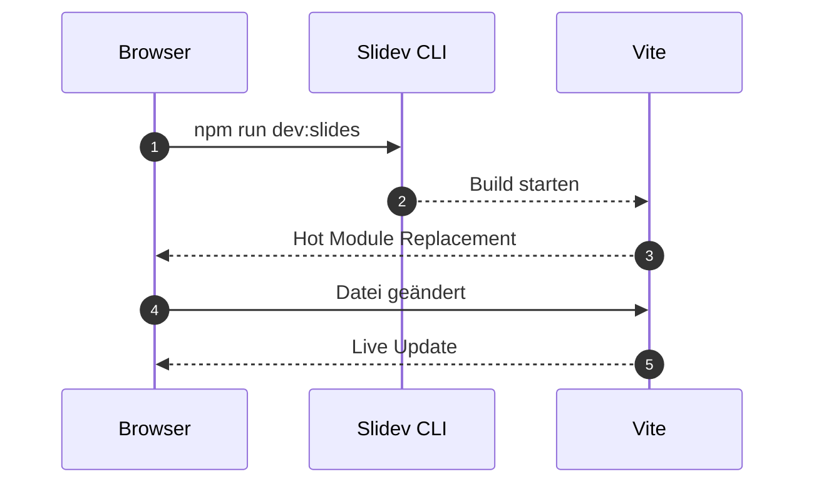
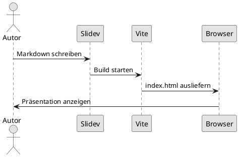

# Slidev Feature-Demo

Slides as Code – direkt aus Markdown gebaut.

<!--
Willkommen! Diese Präsentation demonstriert alle wichtigen Slidev-Features.
Navigiere mit Pfeiltasten oder Klicken durch die Folien.
Das Hintergrundbild oben ist über das `background:`-Feld im Frontmatter gesetzt.
-->

---
layout: section
---

# Inhaltsübersicht

---

# Agenda

<v-clicks>

- 📐 **Layouts** – `two-cols`, `two-cols-header`, `quote`, `statement`, `fact`, `image-right`, …
- 🖼️ **Hintergrundbilder** – `background:` im Frontmatter, Cover-Galerie
- 🎬 **Animationen** – `v-click`, `v-motion`, CSS-Transitionen
- 🧩 **Komponenten** – `Arrow`, `Transform`, `AutoFitText`, `VSwitch`, `LightOrDark`, `VDrag`
- 💻 **Code** – Highlighting, Monaco-Editor, Shiki Magic Move
- 📊 **Diagramme** – Mermaid, PlantUML
- 🔌 **Add-ons** – Add-on-Galerie installieren
- 🎨 **Themes** – Theme wechseln

</v-clicks>

<!--
Jeder Abschnitt wird mit einer Section-Folie eingeleitet.
Der Presenter-Modus zeigt diese Notes an – öffne ihn mit der Taste P.
-->

---
layout: section
---

# 📐 Layouts

---
layout: two-cols
---

# `two-cols`

::left::

### Links

- Punkt A
- Punkt B
- Punkt C

::right::

### Rechts

```js
const cols = ['links', 'rechts']
```

<!--
Das two-cols-Layout teilt die Folie in zwei gleichbreite Spalten.
Inhalte werden mit ::left:: und ::right:: zugewiesen.
-->

---
layout: two-cols-header
---

# `two-cols-header`

Dieser Text spannt beide Spalten.

::left::

### Linke Spalte

Inhalt links

::right::

### Rechte Spalte

Inhalt rechts

::bottom::

_Fußzeile über beide Spalten_

---
layout: quote
---

# „Any sufficiently advanced technology is indistinguishable from magic."

**Arthur C. Clarke**

---
layout: statement
---

# Slides as Code.

---
layout: fact
---

# 100%

Markdown-basiert

---
layout: image-right
image: https://picsum.photos/seed/slidev/640/480
---

# `image-right`

Bild auf der rechten Seite, Text und Inhalte links.

Analog: `image-left`

---
layout: intro
---

# `intro`

Für Vortragende – Name, Titel, Kontakt

---
layout: iframe-right
url: https://vitejs.dev
---

# `iframe-right`

Bettet eine Webseite rechts ein.  
Analog: `iframe-left`, `iframe` (volle Seite)

---
layout: section
---

# 🖼️ Hintergrundbilder

---
layout: cover
background: https://picsum.photos/seed/mountains/1920/1080
---

# `layout: cover` mit Hintergrundbild

Das `background:`-Feld im Frontmatter setzt ein Bild für die gesamte Folie.

```yaml
---
layout: cover
background: https://picsum.photos/seed/mountains/1920/1080
---
```

<!--
Die cover-Layout füllt die gesamte Folie mit dem Hintergrundbild.
Beliebige URLs (lokal oder remote) sind möglich.
-->

---
layout: image-right
image: https://picsum.photos/seed/code/640/960
---

# Bild im `image-right`-Layout

Das `image:`-Feld legt das Bild für das `image-right`/`image-left`-Layout fest.

```yaml
---
layout: image-right
image: https://picsum.photos/seed/code/640/960
---
```

Lokale Bilder liegen in `public/`:

```yaml
image: /mein-bild.jpg
```

---
layout: image
image: https://picsum.photos/seed/fullscreen/1920/1080
---

# `layout: image` – Vollbild

```yaml
---
layout: image
image: https://picsum.photos/seed/fullscreen/1920/1080
---
```

---

# Hintergrundbilder – Alle Optionen

```yaml
# Externe URL
background: https://picsum.photos/1920/1080

# Lokale Datei (public/bg.jpg)
background: /bg.jpg

# Unsplash-Direktlink
background: https://source.unsplash.com/1920x1080/?nature

# Nur Farbe oder CSS-Gradient
background: '#1a1a2e'
background: 'linear-gradient(135deg, #667eea 0%, #764ba2 100%)'
```

**Cover-Galerie:** [sli.dev/resources/covers](https://sli.dev/resources/covers)  
Fertige Hintergrundbilder, kuratiert von der Slidev-Community.

<!--
background: gilt für cover, image, section und alle anderen Layouts.
Im image- und image-right-Layout nutzt man stattdessen das image:-Feld.
-->

---
layout: section
---

# 🎬 Animationen

---
transition: fade
---

# Folienwechsel-Transitionen

Die Transition wird pro Folie im Frontmatter gesetzt (oder global):

```yaml
---
transition: fade           # Einblenden
transition: slide-left     # Von rechts einschieben (Standard hier)
transition: slide-up       # Von unten einschieben
transition: view-transition  # View Transition API
---
```

Diese Folie nutzt `transition: fade`.

---

# `v-click` – Schrittweises Einblenden

<v-click>

1. Erscheint beim **1.** Klick

</v-click>

<v-click>

2. Erscheint beim **2.** Klick

</v-click>

<v-click at="+1">

3. `at="+1"` ist relativ – equivalent zum Standard

</v-click>

<v-after>

> `v-after` folgt dem letzten `v-click` automatisch.

</v-after>

---

# `v-clicks` – Liste auf einmal

```html
<v-clicks>

- Punkt A
- Punkt B
- Punkt C

</v-clicks>
```

<v-clicks>

- Punkt A
- Punkt B
- Punkt C

</v-clicks>

---

# `v-motion` – Bewegungsanimationen

<div class="grid grid-cols-2 gap-6 mt-6">

<div
  v-motion
  :initial="{ x: -80, opacity: 0 }"
  :enter="{ x: 0, opacity: 1, transition: { duration: 600 } }"
  class="bg-blue-100 rounded p-4 text-center"
>
  Von links eingeflogen
</div>

<div
  v-motion
  :initial="{ y: 60, opacity: 0 }"
  :enter="{ y: 0, opacity: 1, transition: { duration: 600, delay: 300 } }"
  class="bg-green-100 rounded p-4 text-center"
>
  Von unten eingeflogen (300 ms Verzögerung)
</div>

</div>

```html
<div
  v-motion
  :initial="{ x: -80, opacity: 0 }"
  :enter="{ x: 0, opacity: 1, transition: { duration: 600 } }"
>
  Von links eingeflogen
</div>
```

<!--
v-motion nutzt @vueuse/motion, das bereits mit @slidev/client gebündelt ist.
initial = Startzustand, enter = Endzustand (wird beim Laden ausgeführt).
-->

---
layout: section
---

# 🧩 Eingebaute Komponenten

---

# `<Arrow>` – Pfeile zeichnen

<Arrow x1="80" y1="350" x2="260" y2="200" color="red" width="3" />
<Arrow x1="400" y1="200" x2="580" y2="330" color="blue" :twoWay="true" />

```html
<!-- Koordinaten in px relativ zur Folie (Standard: 980 × 552) -->
<Arrow x1="80"  y1="350" x2="260" y2="200" color="red" width="3" />
<Arrow x1="400" y1="200" x2="580" y2="330" color="blue" :twoWay="true" />
```

---

# `<Transform>` – Skalieren

<Transform :scale="1.4">

```ts
// Dieser Code-Block ist 140 % groß
const msg = 'Skalierter Inhalt'
```

</Transform>

```html
<Transform :scale="1.4">
  <!-- beliebiger Inhalt – z. B. Code-Block, Bild, Komponente -->
</Transform>
```

---

# `<AutoFitText>` – Automatische Schriftgröße

<AutoFitText :max="120" :min="20" modelValue="Passt sich der Containerbreite an!" />

```html
<AutoFitText
  :max="120"
  :min="20"
  modelValue="Passt sich der Containerbreite an!"
/>
```

---

# `<v-switch>` – Inhalte umschalten

<v-switch>
  <template #1>🐣 Phase 1: Initialisierung</template>
  <template #2>🐥 Phase 2: Verarbeitung</template>
  <template #3>🐓 Phase 3: Abschluss</template>
</v-switch>

Klicke durch die Phasen:

```html
<v-switch>
  <template #1>Phase 1</template>
  <template #2>Phase 2</template>
  <template #3>Phase 3</template>
</v-switch>
```

---

# `<LightOrDark>` – Theme-abhängiger Inhalt

<LightOrDark>
  <template #dark>🌙 Dunkler Modus – nutze dunkle Farben für Diagramme</template>
  <template #light>☀️ Heller Modus – nutze helle Farben für Diagramme</template>
</LightOrDark>

```html
<LightOrDark>
  <template #dark>🌙 Dark Mode Inhalt</template>
  <template #light>☀️ Light Mode Inhalt</template>
</LightOrDark>
```

---

# `<VDrag>` & `<VDragArrow>` – Drag-and-Drop

Im Presenter-Modus sind Elemente frei verschiebbar:

```html
<!-- pos="x,y,breite,höhe" – Position wird in der URL gespeichert -->
<VDrag class="absolute" pos="100,120,240,60">
  <div class="bg-yellow-200 p-2 rounded">Verschiebbar</div>
</VDrag>

<!-- Zieht einen Pfeil zwischen zwei Punkten -->
<VDragArrow pos="200,300,380,180" />
```

---

# `<Link>` – Interne Navigation

Springe zu beliebigen Folien:

```html
<Link to="4">Zu Folie 4 springen</Link>
<Link to="4" title="Folie 4" />
```

<Link to="4">→ Zu Folie 4 (Agenda) springen</Link>

---
layout: section
---

# 💻 Code-Features

---

# Code-Highlighting – Zeilenmarkierungen

Schrittweise Zeilen hervorheben:

```ts {1|2-3|4-5|all}
interface Slide {
  title: string
  layout: string
  transition?: string
  clicks?: number
}
```

Format: `{Zeile|Zeilen|all}` – jeder Schritt entspricht einem Klick.

---

# Shiki Magic Move – Code-Animation

Animierter Übergang zwischen Code-Versionen:

````md magic-move
```js
// Schritt 1
function greet(name) {
  return 'Hallo ' + name
}
```
```js
// Schritt 2 – Template Literal
function greet(name) {
  return `Hallo ${name}!`
}
```
```ts
// Schritt 3 – TypeScript
function greet(name: string): string {
  return `Hallo ${name}!`
}
```
````

---

# Monaco Editor – Interaktiver Code

```ts {monaco}
interface Presentation {
  slug: string
  title: string
  theme: string
}

// Dieser Code ist live editierbar!
const demo: Presentation = {
  slug: 'feature-demo',
  title: 'Slidev Feature-Demo',
  theme: 'default',
}
```

---
layout: section
---

# 📊 Diagramme

---

# Mermaid – Flussdiagramm & Sequenz



---

# PlantUML – UML-Diagramme



---
layout: section
---

# 🔌 Add-ons

---

# Slidev Add-ons

Add-ons erweitern Slidev mit neuen Komponenten, Layouts und Features.

```yaml
# Frontmatter der Präsentation
---
addons:
  - slidev-addon-qrcode      # <QRCode> Komponente
  - slidev-addon-excalidraw  # <Excalidraw> Diagramme
  - slidev-addon-citations   # Wissenschaftliche Zitate
  - slidev-addon-tldraw      # Whiteboard-Diagramme
---
```

**Installation:**

```bash
npm install -D slidev-addon-qrcode
```

Dann `<QRCode value="https://sli.dev" />` direkt in Markdown nutzen.

**Add-on-Galerie:** [sli.dev/resources/addon-gallery](https://sli.dev/resources/addon-gallery)

<!--
Add-ons werden wie npm-Pakete installiert und im addons:-Feld der
Präsentation registriert. Sie können Layouts, Komponenten und Styles
hinzufügen.
-->

---
layout: section
---

# 🎨 Themes

---

# Theme wechseln

Das Theme wird im **Frontmatter** jeder Präsentation gesetzt:

```yaml
---
theme: default        # Standard (aktuell aktiv)
# theme: seriph       # Elegant, Serif-Schrift
# theme: apple-basic  # Minimalistisch
# theme: penguin      # Modern & bunt
---
```

**Neues Theme ausprobieren:**

1. Theme-Paket installieren: `npm install -D @slidev/theme-seriph`
2. `theme: seriph` im Frontmatter setzen
3. `npm run dev:slides` neu starten

Themes-Galerie: [sli.dev/themes/gallery](https://sli.dev/themes/gallery)

<!--
Themes können Layouts, Stile und Schriften anpassen.
Sie werden automatisch heruntergeladen, wenn der Name bekannt ist.
-->

---
layout: end
---

# Viel Erfolg!

---
layout: center
---

# Neue Präsentation starten

```bash
# Datei in /content erstellen
cp content/beispiel-praesentation.md content/mein-vortrag.md

# Lokal entwickeln
npm run dev:slides
```

Die neue Präsentation erscheint automatisch auf der Landing-Page.
