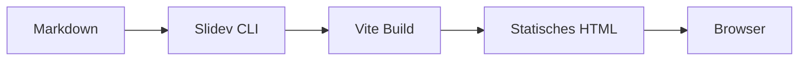

# Slidev Feature-Demo

Slides as Code – direkt aus Markdown gebaut.

<!--
Willkommen! Dies ist eine vollständige Feature-Demo für Slidev.
-->

---
layout: section
---

# Inhalt

---

# Agenda

<v-clicks>

- 📐 **Layouts** – `two-cols`, `section`, `center`, `image-right`
- 💻 **Code-Highlighting** – Zeilenmarkierungen, Zeilennummern
- 🖱️ **Animationen** – `v-click`, `v-after`
- 📊 **Diagramme** – Mermaid
- 🔢 **Mathe** – LaTeX via KaTeX
- 🎨 **Themes** – Theme wechseln
- 📝 **Speaker Notes** – HTML-Kommentare

</v-clicks>

<!--
Alle Features werden auf den folgenden Folien demonstriert.
-->

---
layout: two-cols
---

# Zwei-Spalten-Layout

::left::

### Links

- Feature A
- Feature B
- Feature C

::right::

### Rechts

```js
const features = [
  'two-cols',
  'section',
  'center',
]
```

<!--
Das `two-cols`-Layout teilt die Folie in zwei gleichbreite Spalten.
-->

---

# Code-Highlighting

Einzelne Zeilen hervorheben mit `{}`-Syntax:

```ts {2,5|1-3|all}
interface Presentation {
  slug: string      // ← hervorgehoben in Schritt 1
  title: string     // ← hervorgehoben in Schritt 1
  description: string
  tags: string[]    // ← hervorgehoben in Schritt 1
}
```

<v-click>

Zeilen werden schrittweise beim Klicken animiert.

</v-click>

---

# Animationen mit `v-click`

Elemente nacheinander einblenden:

<v-click>

1. Schritt eins erscheint zuerst

</v-click>

<v-click>

2. Dann Schritt zwei

</v-click>

<v-click>

3. Und schließlich Schritt drei

</v-click>

<v-after>

> Fertig! `v-after` folgt dem letzten `v-click` automatisch.

</v-after>

---

# Mermaid-Diagramme



<!--
Mermaid-Diagramme werden serverseitig gerendert – kein JavaScript nötig.
-->

---

# LaTeX-Mathe mit KaTeX

Inline: $E = mc^2$

Block:

$$
\frac{d}{dx}\left( \int_{0}^{x} f(u)\,du\right)=f(x)
$$

---
layout: center
---

# 🎨 Theme wechseln

---

# Theme wechseln

Das Theme wird im **Frontmatter** der Präsentation gesetzt:

```yaml
---
theme: default        # Standard (aktuell aktiv)
# theme: seriph       # Elegant, Serif-Schrift
# theme: apple-basic  # Minimalistisch
---
```

**Neues Theme ausprobieren:**

1. Theme-Paket installieren: `npm install -D @slidev/theme-seriph`
2. `theme: seriph` im Frontmatter setzen
3. `npm run dev:slides` neu starten

Verfügbare Themes: [slidev.dev/themes/gallery](https://sli.dev/themes/gallery)

<!--
Themes lassen sich ohne Code-Änderungen an den Slides tauschen –
einfach den theme-Wert im Frontmatter anpassen.
-->

---
layout: two-cols
---

# Weitere Layout-Optionen

::left::

**`layout: cover`**
Titelfolie mit großem Hintergrund

**`layout: section`**
Trennfolie für neue Abschnitte

**`layout: center`**
Inhalt zentriert (horizontal + vertikal)

**`layout: full`**
Kein Padding, volle Fläche

::right::

**`layout: image-right`**
Bild rechts, Text links

**`layout: image-left`**
Bild links, Text rechts

**`layout: two-cols`**
Zwei gleiche Spalten (diese Folie!)

---
layout: center
---

# Los geht's!

Neue Präsentation anlegen:

```bash
# Datei in /content erstellen
cp content/beispiel-praesentation.md content/mein-vortrag.md

# Lokal entwickeln
npm run dev:slides
# oder direkt:
./node_modules/.bin/slidev content/mein-vortrag.md
```

Die neue Präsentation erscheint automatisch auf der Landing-Page.
